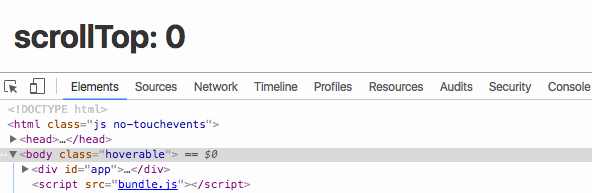

# react-browser-interaction

# 

> A react higher order component that checks interaction on the browser.

This component checks whether the browser is hoverable, i.e. non-touch screen device, or hoverable, i.e. touch-screen device. Besides that it also checks for screen resize, and scroll browser events.

## Install

```bash
$ npm install --save react-browser-interaction
```

## Usage

```javascript

// container.js

import React, { Component } from 'react';
import browserInteractionHOC from 'react-browser-interaction';

class Container extends Component {
    render() {
        return (
            <div></div>
        )
    }
}

export default browserInteractionHOC(Container, 1200, 'hoverable', 'scrolled');

// app.js

import React from 'react';
import { render } from 'react-dom';
import Container from './container';

render(<Container />, document.getElementById('app'));

```

## API

### browserInteractionHOC(component, screenWidth, hoverClass, scrollClass)

#### component

Type: `function`

Any React component to be wrapped. However `react-browser-interaction` is a higher-order-component that tracks browser interaction, therefore it is most favorably used on the `container` element of the page, and is **used only once**.

#### screenWidth

Type: `number`

Throttling screen resize.

#### hoverClass

Type: `string`

Name of hover class to be added to the `body` element if the browser is "hoverable".

#### scrollClass

Type: `string`

Name of scroll class to be added to the `body` element if the browser is scrolled.

## License

MIT © Jonathan Chan
